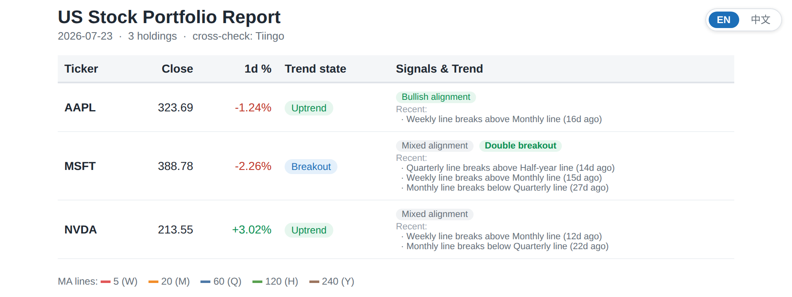
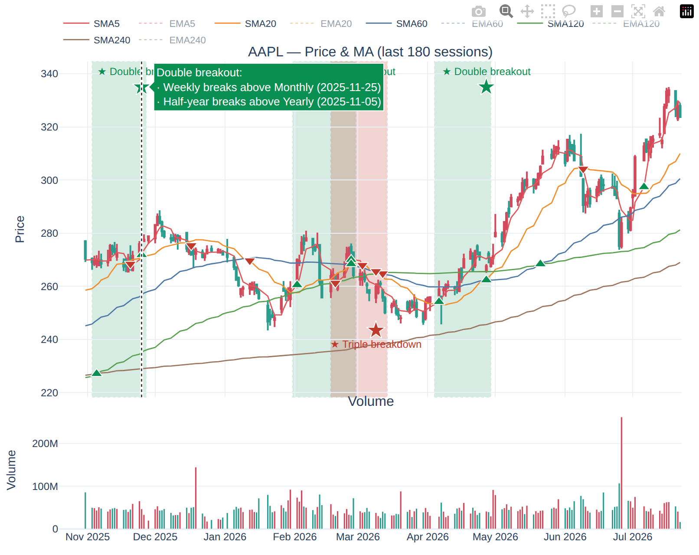
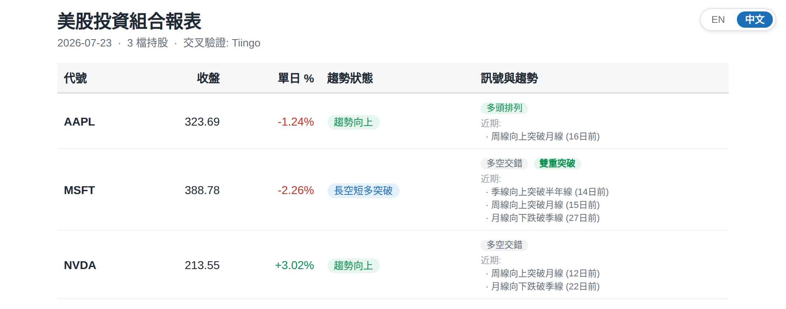

# portfolio-monitor

A daily monitor for a US-stock watchlist. It fetches OHLCV history, computes
SMA/EMA moving-average lines (5/20/60/120/240 trading days = week/month/quarter/
half-year/year), detects trend transitions, renders interactive charts, builds an
HTML report, optionally emails it, and stores everything in a local SQLite
database. Notes are bilingual (English / 繁體中文).

I run it from cron after the US close and read the report in a browser.

## Screenshots

The daily report. The summary table shows each ticker's trend state, MA
alignment, and any multi-line breakout tags, with the recent crossings listed
underneath:



The interactive chart: moving-average lines, a marker at every cross (up-triangle
for a breakout, down-triangle for a breakdown), a shaded band over multi-line
clusters, and a hover popup naming each constituent crossing and its date:



The report is bilingual; the top-right control switches between English and
繁體中文, and the charts follow:



## What it does

1. Watchlist kept in a CSV (`config/portfolio.csv`), managed by a small CLI.
2. Daily OHLCV + volume fetch from Yahoo Finance (via `yfinance`), with an
   optional independent Tiingo cross-check and a set of internal data-quality
   checks (NaN, non-positive prices, non-monotonic/duplicate dates, high < low,
   staleness, implausible daily moves).
3. Moving averages: SMA and EMA for each period.
4. Signals:
   - Golden/death cross and long/short trend-state transitions, emitted only on
     the bar where the state actually changes.
   - Per-adjacent-pair cross detail (e.g. "月線向上突破季線"), with a dual-trend
     note when a related same-direction cross fired recently.
   - An always-present trend summary per ticker: MA alignment
     (多頭排列 / 空頭排列 / 多空交錯), multi-line breakout/breakdown tags
     (雙重・三重・四重突破／跌破) over a lookback window, and a recent-crossings
     list with days-ago.
5. Report: a self-contained UTF-8 HTML file with interactive Plotly charts
   (hover shows date/OHLC/SMA/EMA/volume) and a top-right English / 中文 switcher
   (default English). Each crossing in view is marked on the chart (▲ breakout /
   ▼ breakdown) with a hover popup naming the lines and the date; multi-line
   clusters get a shaded highlight band and a star label whose popup lists the
   constituent crossings. A static PNG is kept as a no-JS fallback and for email.
6. Email: Gmail SMTP with the chart inlined as a PNG. Dry-run by default (writes
   an `.eml` for inspection). With `--send`, if SMTP is not configured the email
   step is skipped rather than failing, so a cron job stays green.
7. Storage: SQLite at `data/portfolio.db`, all writes idempotent.

## Requirements

- Python 3.11. A local venv is expected at `.venv`.

## Setup

```bash
python3.11 -m venv .venv
./.venv/bin/pip install -r requirements.txt

cp config/portfolio.example.csv config/portfolio.csv   # then edit your holdings
cp .env.example .env                                    # optional, for email/Tiingo
```

`config/portfolio.csv` and `.env` are gitignored. Until you create
`portfolio.csv`, the loader falls back to `portfolio.example.csv`.

The package lives under `src/`. Either export the path per shell:

```bash
export PYTHONPATH=src
./.venv/bin/python -m portfolio_monitor.pipeline --help
```

or use `scripts/run_daily.sh`, which sets `PYTHONPATH` itself.

## Configuration

Program settings are in `config/settings.yaml` (history length, MA periods,
signal windows, cross-check tolerance). The watchlist is `config/portfolio.csv`
(`symbol,name` per row).

Secrets go in `.env` (see `.env.example`):

| Variable | Purpose |
|----------|---------|
| `SMTP_USER` | Gmail address that sends the report |
| `SMTP_APP_PASSWORD` | Google App Password (not the login password) |
| `REPORT_RECIPIENT` | Where the report is delivered |
| `REPORT_CC` | Optional, comma-separated |
| `TIINGO_API_KEY` | Optional free key; enables the yfinance-vs-Tiingo cross-check |

### Gmail App Password

Enable 2-Step Verification, then create an App Password under
Google Account -> Security -> App passwords ("Mail"), and put the 16-character
value in `SMTP_APP_PASSWORD`. Leave `SMTP_USER`/`SMTP_APP_PASSWORD` blank to keep
the pipeline in dry-run.

### Tiingo key (optional)

Register at <https://www.tiingo.com/>, copy the API token into `TIINGO_API_KEY`.
When set, each fetch is validated against Tiingo's close within
`crosscheck_tolerance_pct`. Without it, the tool runs on yfinance alone plus the
internal checks.

## Managing the watchlist

```bash
export PYTHONPATH=src
./.venv/bin/python -m portfolio_monitor.config list
./.venv/bin/python -m portfolio_monitor.config add NVDA "NVIDIA Corp."
./.venv/bin/python -m portfolio_monitor.config remove NVDA
./.venv/bin/python -m portfolio_monitor.config sync   # reconcile the DB to the CSV
```

## Running

```bash
export PYTHONPATH=src
./.venv/bin/python -m portfolio_monitor.pipeline --verbose      # dry-run email
./.venv/bin/python -m portfolio_monitor.pipeline --send         # send (needs .env)
./.venv/bin/python -m portfolio_monitor.pipeline --no-email     # HTML only
./.venv/bin/python -m portfolio_monitor.pipeline --tickers AAPL MSFT
```

Outputs:

- `reports/<date>.html` — self-contained interactive report.
- `reports/<date>.eml` — the email message (dry-run) for inspection.
- `reports/charts/<TICKER>.png` — per-ticker static charts.
- `data/portfolio.db` — prices, indicators, signals, run audit.

## Scheduling

US markets close 16:00 ET; end-of-day data is reliably available a few hours
later. A cron entry running Tue–Sat covers Mon–Fri closes:

```cron
0 6 * * 2-6 /path/to/portfolio-monitor/scripts/run_daily.sh --send
```

Logs go to `logs/daily-<date>.log`; a non-zero exit triggers cron's own mail.
With `--send`, the email step is skipped while SMTP is unconfigured, so it is
safe to install `--send` up front — it starts sending once a Gmail App Password
is set.

## Tests

```bash
export PYTHONPATH=src
./.venv/bin/python -m pytest -q
```

## Data sources and disclaimer

Primary data is Yahoo Finance via `yfinance`, which is unofficial and can break.
The optional cross-check is Tiingo. This is for personal monitoring only and is
not investment advice.

## Layout

```
config/settings.yaml         program settings (tracked)
config/portfolio.example.csv example watchlist (tracked)
config/portfolio.csv         your watchlist (gitignored)
src/portfolio_monitor/       config, db, fetch, indicators, signals, charts,
                             report, email_sender, pipeline
templates/report.html.j2     report template
scripts/run_daily.sh         cron wrapper
tests/                       pytest suite
data/ reports/ logs/         generated (gitignored)
```

## License

Apache License 2.0. See [LICENSE](LICENSE).
